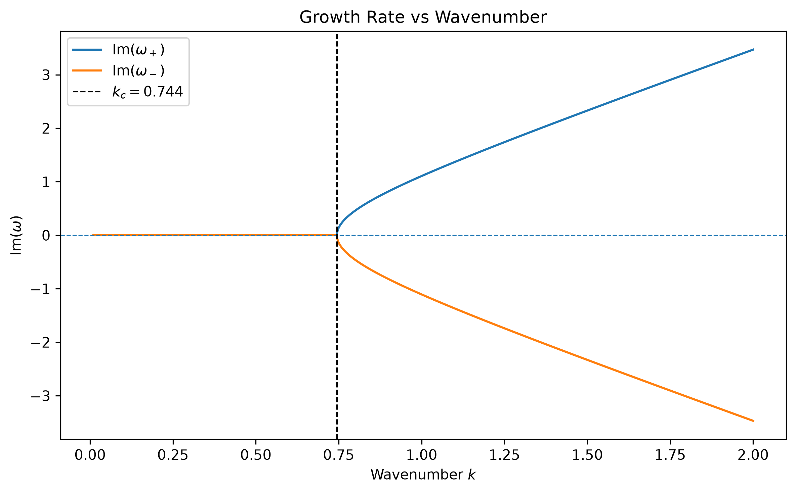
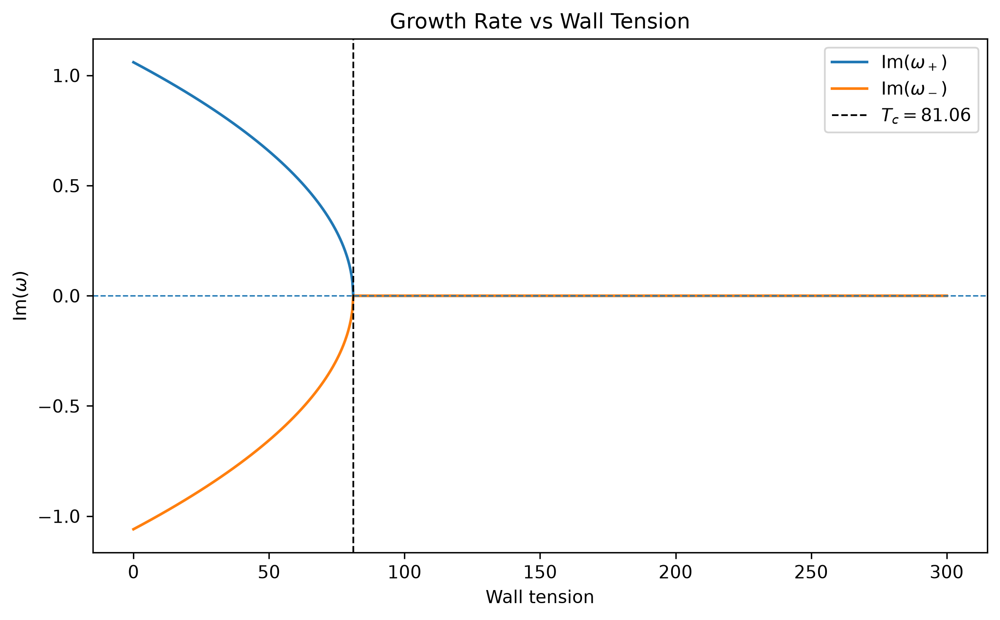
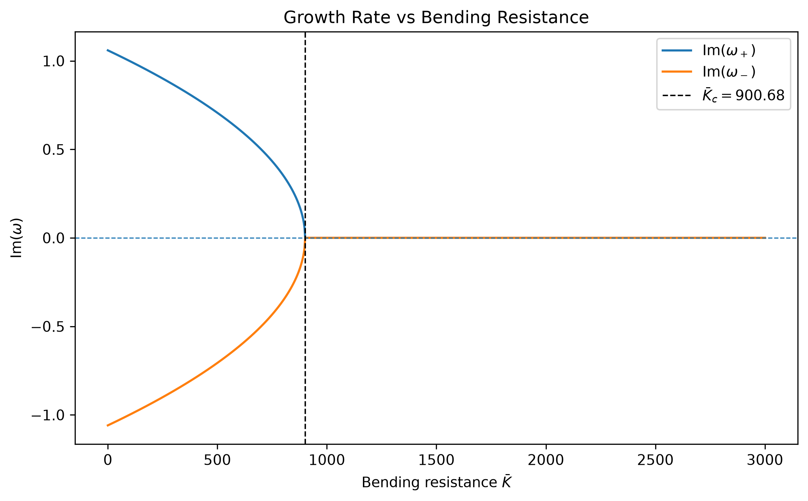

# Fluid Stability Analysis

Numerical investigation of hydrodynamic instability using Python.

This project is based on my final-year Mathematics & Statistics research project at the University of Glasgow. It explores how wavenumber, wall tension and bending resistance affect the stability of wave modes.

## Methods

- Dispersion relation analysis
- Complex-valued frequency calculations
- Numerical parameter sweeps
- Brent root-finding
- Stability threshold detection

## Tools

Python, NumPy, SciPy and Matplotlib.

## Results

### Wavenumber

Critical wavenumber:

**k_c = 0.744464**

Below this value the frequency branches remain real. Above the threshold, an imaginary component develops, indicating the onset of instability.

### Wall Tension

Critical wall tension:

**T_c = 81.061538**

For the selected parameters, increasing wall tension suppresses the unstable mode.

### Bending Resistance

Critical bending resistance:

**K_c = 900.683761**

For the selected parameters, increasing bending resistance stabilises the system.

## Numerical Method

The stability boundary occurs when the discriminant of the dispersion relation changes sign.

The scripts first perform a parameter sweep to identify a sign change, then use SciPy's Brent root-finding algorithm to calculate the critical value more accurately.

## Project Structure

    src/
        dispersion_relation.py

    examples/
        wavenumber_analysis.py
        tension_analysis.py
        bending_analysis.py

    figures/
        wavenumber_stability.png
        tension_stability.png
        bending_stability.png

    requirements.txt

## Running the Project

Install the required packages:

    pip install -r requirements.txt

Run the analyses:

    python -m examples.wavenumber_analysis
    python -m examples.tension_analysis
    python -m examples.bending_analysis